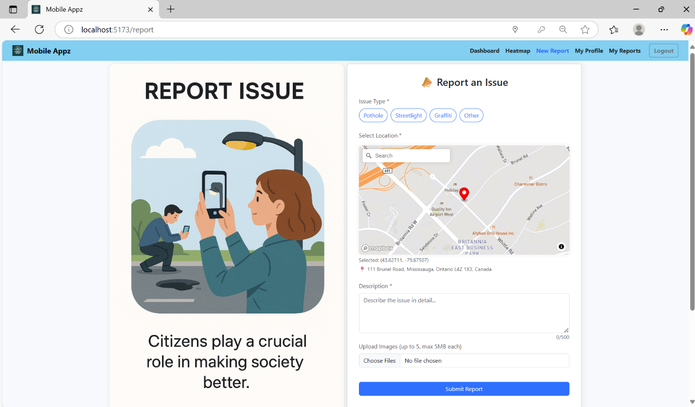
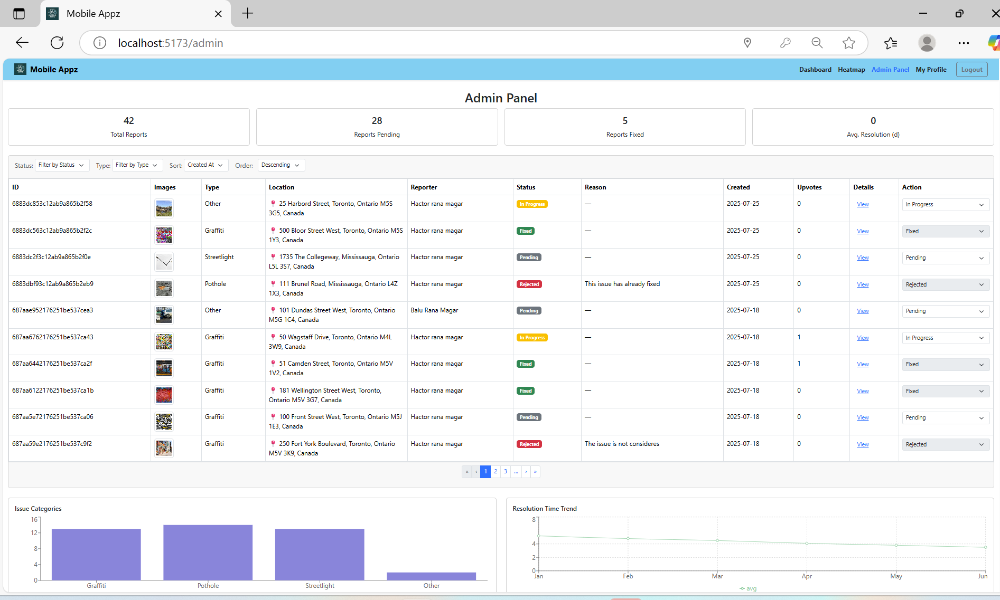
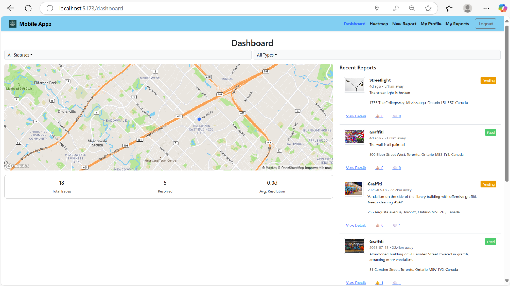
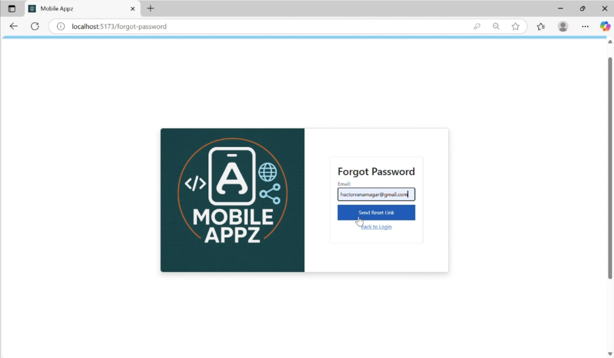
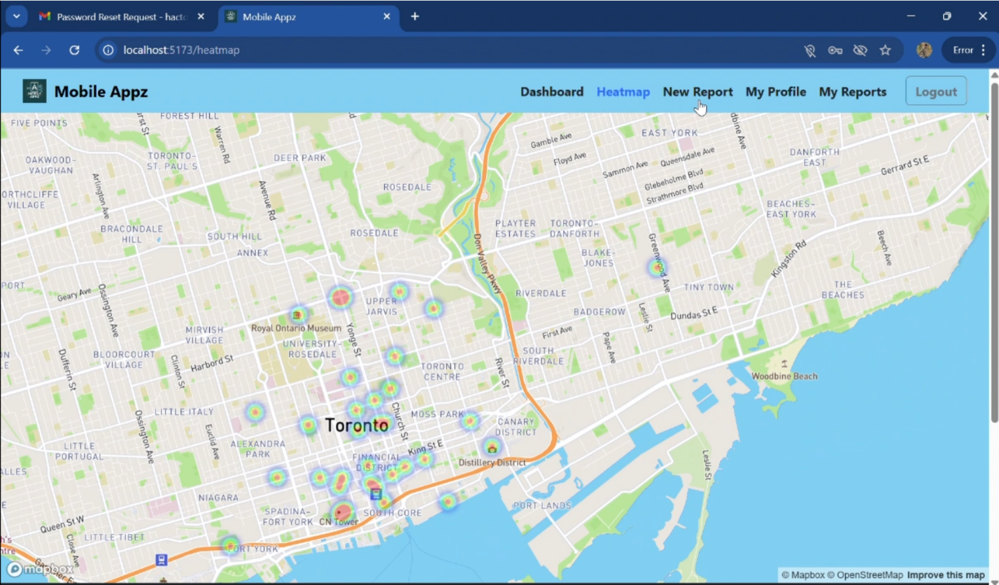

# Mobile Appz – Crowdsourced Road Repair & Infrastructure Feedback

Mobile Appz is a full-stack platform where citizens can report infrastructure issues like potholes, broken streetlights, or graffiti. Reports are geo-tagged, displayed on an interactive map, and analyzed using ML-powered heatmaps to help municipalities prioritize and resolve issues faster.

---

## 🚀 Features
- 📍 Report issues with photo uploads & live location tagging  
- 🗺 Interactive map view with filters and heatmaps  
- 🛠 Admin & user dashboards for report management  
- 🔑 Secure login & registration with authentication  
- 📧 Email notifications for verification and updates  
- 👍 Public upvotes & comments to prioritize issues  
- 🔥 Heatmaps to detect recurring problem areas  

---

## 🛠 Tech Stack
- **Frontend:** React.js, Mapbox API, Axios  
- **Backend:** Node.js, Express.js, MongoDB, Multer, Nodemailer  
- **ML:** Python (Flask), scikit-learn, GeoJSON  

---

## 📸 Screenshots  
> ## 📸 Screenshots

### Single image


### Link the image to open full-size
[](public/SignIn.png)
###admin panel


### Two images side by side (Markdown table)
| changeMyProfile | Map with Markers |
|---|---|
|  |  |

### Three in a row (small thumbnails)
| Login | Dashboard | Heatmap |
|---|---|---|
|  |  |  |
*Heatmap highlighting recurring issue clusters.*
### With a short caption
  


**Frontend repo:**
1. Report Form Page – with image upload & location picker  
2. Dashboard – user reports list & status  
3. Map View – markers and heatmap

**Backend repo:**
1. Postman API test – login & report creation  
2. MongoDB connection success in terminal  
3. Email log – verification email sent

**ML repo:**
1. Heatmap API JSON output in terminal  
2. Cluster visualization from ML service


---

## 👨‍💻 My Role

**Frontend:**  
- Built the **report submission form** with validation  
- Integrated **Mapbox** for live location tagging & reverse geocoding  
- Developed parts of the **user dashboard** for report management  
- Implemented **login UI** and integrated authentication flow  

**Backend:**  
- Configured **MongoDB connection**  
- Created **API endpoints** for storing reports, fetching dashboard data, and handling authentication  
- Implemented **Multer** for image uploads  
- Added **Nodemailer** for sending verification & update emails  
- Set up **authentication middleware** and JWT token handling  

**ML Service:**  
- Assisted with **database integration** to store and retrieve ML-processed heatmap data  

---

## 🏃 Getting Started

**Frontend:**
```bash
npm install
npm run dev

**Backend:**
npm install
npm run dev

**ML:**
pip install -r requirements.txt
python app.py

